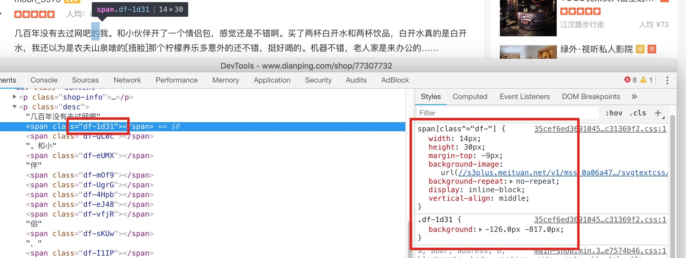
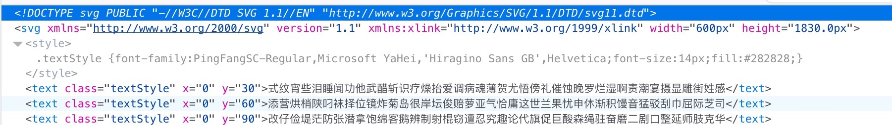
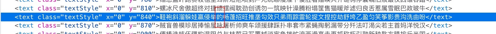

# 点评评论

> **爬点评评论时，发现评论不太对**
> **查看页面源码,这....好狠啊**



## 思路

**先看看CSS文件内容**
```css
.df-1d31 {
    background: -126.0px -817.0px;
}

span[class^="df-"] {
    width: 14px;
    height: 30px;
    margin-top: -9px;
    background-image: url(//s3plus.meituan.net/v1/mss_0a06a471f9514fc79c981b5466f56b91/svgtextcss/9b3ced441245730faf7a042749044cad.svg);
    background-repeat: no-repeat;
    display: inline-block;
    vertical-align: middle;
}
```
**再看看SVG内容**

**`font-size:14px;`**

**那么就试着算一下，看看能不能找到`的`:**  
**index = (126 / 14 = 9)**  
**然后找 y = 817,只找到相近的,试一下发现 y = 840 > 817 的第一行就是,不过这个y应该可以直接算出来**  
**最后还是找到这个字:`的`**  


**还真是这样,开始撸代码吧**  
**代码有点儿乱,凑合着看😄**
